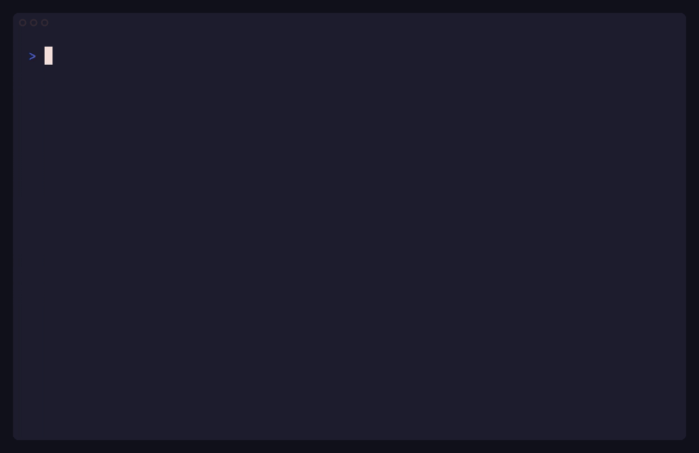

# tturl: timeless timing and request races over HTTP/2

`tturl` is the HTTP/2 CLI for finding tiny timing differences and winning
request races. It releases batches over HTTP/2 and records response arrival
order, then either shows what happened or helps distinguish a repeatable
arrival-order signal from noise.

[](https://pkg.go.dev/github.com/tantosec/tturl)



<details>

<summary>Transcript</summary>

```
> # 44.211.94.34 is running 'tturl demo-server'
> # it is a very long way away
> 
> ping -c4 -i0.5 44.211.94.34
PING 44.211.94.34 (44.211.94.34) 56(84) bytes of data.
64 bytes from 44.211.94.34: icmp_seq=1 ttl=117 time=220 ms
64 bytes from 44.211.94.34: icmp_seq=2 ttl=117 time=221 ms
64 bytes from 44.211.94.34: icmp_seq=3 ttl=117 time=221 ms
64 bytes from 44.211.94.34: icmp_seq=4 ttl=117 time=221 ms

--- 44.211.94.34 ping statistics ---
4 packets transmitted, 4 received, 0% packet loss, time 1501ms
rtt min/avg/max/mdev = 220.396/220.618/220.830/0.159 ms
> 
> # the /sleep route spin-sleeps for a custom duration before returning.
> # we can compare requests whose sleep differs by just 2.5 microseconds.
> 
> tturl analyse -k \
>   --connections-fit --batch-rate-max 100/s --connections-fit-max unlimited \
>   --block 'https://44.211.94.34:8443/sleep?duration=100us' --name fast \
>   --block 'https://44.211.94.34:8443/sleep?duration=102.5us' --name slow
================================================================================
                                 tturl analyse
================================================================================

----------------------------------- Requests -----------------------------------

Target: https://44.211.94.34:8443

  fast    GET  /sleep?duration=100us
  slow    GET  /sleep?duration=102.5us

Total: 2 requests.

---------------------------------- Experiment ----------------------------------

Design: 150 balanced rotation cycles (300 trials,
        600 measured request operations).
Arrangement: rotate; each request occupies every position once per cycle.
Priming: none; early trials may include cold-state effects.
Power: the fixed workload is a power choice, not a guarantee for this target.
Pacing: 2 requests/batch; batch-rate ceiling 100/s; request-rate ceiling
        unlimited; minimum batch-start interval 10ms.
Connections: up to 28 active; path-fitted from 219ms HTTP/2 PING RTT with 25%
             (at least one connection) headroom; network RTT only; service time
             excluded; --connections-fit-max unlimited permits any fit.
Streams: honour the peer's advertised concurrent-stream limit.
Response limits: 8MiB accepted body per stream; 30s transport time per batch.
Run timeout: unlimited for live request execution.
TLS: certificate verification disabled (--insecure).

------------------------------- Analysis result --------------------------------

Finding: Evidence of a request-identity effect on relative arrival order
Evidence: 150 cycles; 300 trials; 600 measured request operations.
Overall test across all requests:
  Monte Carlo randomisation: p=0.0001 <= 0.05.
  Reference distribution: 9,999 randomisations sampled.
Holm-adjusted pair evidence: 1/1 pair supported.
  earlier  later  before/trials  mean rank gap  adjusted p
  fast     slow         213/300           0.42   1.939e-11

Rank profile (first -> last):
  Intensity (% upper bound): . 0 | : 12.5 | - 25 | = 37.5 | + 50
                             * 62.5 | # 75 | % 87.5 | @ 100
  request  profile      mean  normalised
  fast     [####====]   0.29        0.29
  slow     [====####]   0.71        0.71

Rank counts (columns are ranks 0..1; 300 retained trials):
  fast     [ 213   87 ]
  slow     [  87  213 ]

Interpretation: Evidence supports a relative arrival-order difference under this
experiment's requests and delivery conditions. It does not establish the cause,
an elapsed-time gap, or practical significance.

----------------------------- HTTP status outcomes -----------------------------

HTTP 204 for all 600 ranked responses.

-------------------------------- Position check --------------------------------

Mean ranks: 0.44-0.56 across outbound positions (spread 0.13).

---------------------------------- Execution -----------------------------------

Trials: 300/300 attempted; 300 rank-complete; 0 incomplete; 300 retained; 0
        excluded; 0 unattempted.
Cycles: 150/150 attempted; 150 complete; 0 incomplete; 150 retained; 0
        unattempted.
Connections: 28 planned; 28 observed; 0 replacements.
Measured request operations: 600 attempted; 600 rank-complete; 600 retained.

------------------------------------ Method ------------------------------------

Global A=max(L2,Linf/sqrt(2)): A=0.42, L2=0.42, Linf=0.42.
Calibration: monte_carlo_randomisation; alpha=0.05.
Calibration completion: fixed_draw_budget_complete.
Reproduction: seed=7848464914323373674; draws=9999; extremes=0.
All pair tests (two-sided R with Holm adjustment):
  fast vs slow: raw p=1.939e-11; adjusted p=1.939e-11; selected.
```

</details>

## What is a timeless timing attack?

Timing side channels often hide beneath network jitter. Sending two requests
separately compares both their server work and two different trips through the
network.

A timeless timing attack instead relies on requests arriving simultaneously and
being handled concurrently, then observes only which response arrives first.
tturl uses a shared header or final body release to encourage near-simultaneous
arrival, which may lead to concurrent handling by the server. A client cannot
guarantee either outcome.

Sharing the journey makes much network-path jitter common to the batch.
Repeating the trial and balancing each request across outbound positions can
reveal a systematic difference in their relative order.

`tturl` realises those boundaries over HTTP/2 and TLS. Bodyless requests become
complete in a shared header record. With tail withholding enabled, requests
carrying bodies become complete in a later shared record containing their
withheld tails and END_STREAM. Batches which mix bodyless and body-carrying
requests therefore do not complete at one gate. Withholding zero chooses no
fixed tail or pause; tturl still completes every non-empty body in the first
feasible shared final record.

A conforming TLS endpoint authenticates a whole record before releasing its
plaintext to HTTP/2. A server can start work on headers or body prefixes before
body finalisation. Parsing, server scheduling, queueing, contention and
intermediaries remain relevant to the observed order. Shared delivery is not
atomic server execution or a guarantee of simultaneous forwarding.

The technique was introduced by Van Goethem et al. in
[“Timeless Timing Attacks” (USENIX Security 2020)](https://www.usenix.org/conference/usenixsecurity20/presentation/van-goethem).

## Check-then-act request races

The same HTTP/2 batch-release primitive can attack check-then-act bugs without
measuring time at all. Releasing several requests as one batch may encourage
concurrent handling, allowing them all to pass a limit check before any request
commits its effect. This may overrun quotas, balances, stock, or single-use
operations.

## Install

### Install using Go

With Go 1.26.6 or newer:

```console
go install github.com/tantosec/tturl/cmd/tturl@latest
```

### Run using Nix

```console
nix run github:tantosec/tturl#tturl
```

### Run using Docker

```console
docker run --rm ghcr.io/tantosec/tturl:latest --help
```

Images support Linux `amd64` and `arm64`. Available tags include `latest`, as
well as major, minor, patch, and release candidate versions.

### Download a release archive

Pre-built archives for Linux, macOS, and Windows are available from the
[repository releases](https://github.com/tantosec/tturl/releases).

## Start here

New to tturl? Run `tturl help getting-started` for a hands-on tour: start a
local server, compare two requests, and learn to read their arrival-order
report. Run `tturl help` for the full topic index, including experiment design,
request construction, and delivery.

Use `tturl --help` for the command map and `tturl <command> --help` for a
command's complete flag reference.

Using an AI harness? Tell it to run `tturl help` so it learns how to use tturl
and makes no mistakes.

### See it in action

Start the built-in HTTP/2 demo target:

```console
tturl demo-server
```

Then compare two requests whose server work differs by 400 microseconds:

```console
tturl measure -k \
  --block 'https://127.0.0.1:8443/sleep?duration=100us' --name short \
  --block 'https://127.0.0.1:8443/sleep?duration=500us' --name long
```

`tturl measure` rotates the requests through both outbound positions, repeats
the batch, and reports their relative arrival ranks and pairwise precedence
without claiming a statistical finding. Run `tturl help getting-started` to
learn how to read the report.

Try running `tturl demo-server` on a distant machine. The shared TLS-record
gate makes network-path jitter common to the batch, allowing small timing
differences to remain visible in response arrival order even over long
distances.

`tturl demo-server` supports Linux and macOS only.

## Choose the right tool for the job

- `tturl race` preserves individual responses and arrival order for each trial.
- `tturl measure` describes arrival ranks across a repeated fixed batch.
- `tturl analyse` tests a fixed batch for a systematic difference.
- `tturl detect` (beta) adaptively tests for one early or late arrival-order outlier.
- `tturl time` (beta) describes request durations over HTTP/2 or HTTP/1.1, from
  each request's initial release to complete, valid final response headers.

Start with `tturl race` or `tturl measure` when exploring an unfamiliar target.
Use `tturl help commands` to choose an inferential workflow only after the
requests and responses make sense.

`tturl time` keeps one active request per physical connection. It can run
requests sequentially on reused connections or synchronise a trial across
separate connections. Its text digest shows duration distributions; JSON Lines
retains monotonic milestones, response evidence and execution accounting.
These client observations include transport and protocol handling. They do
not isolate server processing or supply a statistical finding. Run
`tturl help time` for release controls, priming, bounds and interpretation.

`tturl time` supports Linux and macOS only.

## Express yourself

`tturl` defines an experiment using a curl-like syntax. Blocks are used to
define requests, and each block inherits a shared preamble. For more information
see `tturl help requests`.

Start with shared defaults:

```text
tturl race \
    --insecure \
    --header 'Authorization: Bearer foo' \
    https://host.example/default \
```

Add a header while inheriting the shared defaults:

```text
    --block --name 'Add header' \
        --header 'X-Forwarded-For: 127.0.0.1' \
```

Replace the inherited header:

```text
    --block --name 'Replace header' \
        --delete-header Authorization \
        --header 'Authorization: Bearer bar' \
```

Expand one block into three more requests:

```text
    --block --name 'Vary' \
        'https://host.example/special?value=VAL' \
        --vary=VAL='{one,two,three}'
```

Taken together, these blocks generate five requests:

```
================================================================================
                                   tturl race
================================================================================

----------------------------------- Requests -----------------------------------

Target: https://host.example

  Add header      GET  /default  Authorization: Bearer foo  X-Forwarded-For: 127.0.0.1
  Replace header  GET  /default  Authorization: Bearer bar
  Vary            GET  /special?value=VAL  vary {one,two,three} (3)  Authorization: Bearer foo

[... SNIP ...]
```

## Structured output

Use `--report json` to get JSON Lines. Stream them into other tools, or wrap
tturl to solve a gnarly problem. The versioned contracts and compatibility
policy are indexed with the [JSON Schemas](cmd/tturl/doc/schemas/README.md). The
[structured-output contract](cmd/tturl/doc/structured-output-contract.md)
defines whole-stream ordering, joins, bytes and accounting. Run `tturl schema`
to see the shipped subjects and how to export their JSON Schemas.

## Shell completion

tturl provides tab completion for Bash, Zsh, and fish. Load it for the current
session with the command for your shell:

```console
# Bash
source <(tturl completion bash)

# Zsh
source <(tturl completion zsh)

# fish
tturl completion fish | source
```

Run `tturl help completion` for installation instructions.

## Limitations

- The arrival-order commands require target hosts to support HTTP/2 over TLS.
- Every request in one batch must be to the same host and port.
- An intermediary or proxy that terminates or reframes TLS or HTTP/2 can change
  what you're actually testing.
- Arrival order is evidence, not a cause. Experiment design, HTTP/2 processing,
  scheduling, queueing, contention, and intermediaries can all influence it.

Design your experiments thoughtfully. High concurrency or throughput can
introduce contention, and long gaps between batches can let caches expire or
the target enter an idle state. Either can change the signal under test.

## Do it yourself

Got a tricky HTTP/2 timeless timing problem that tturl can't solve? tturl was
designed so you can drive the core engine and break new ground.

The supported Go library API consists of `tth2` and `stats`.

[`tth2`](https://pkg.go.dev/github.com/tantosec/tturl/tth2) is the
supported HTTP/2 batch-release engine for specialised applications. It sends
same-origin request batches behind a shared TLS-record gate and reports
relative response arrival order.

[`stats`](https://pkg.go.dev/github.com/tantosec/tturl/stats) is a
domain-free library of statistical primitives, including distributions,
estimators, sequential rules, and rank-based models.

The [external examples](tth2/example_test.go) show batch sending, connection
leases, streamed response capture, and arrival ranks composed with a statistical
estimator.

For more information see the
[Go Reference](https://pkg.go.dev/github.com/tantosec/tturl).

## Build from source

From a checkout:

```console
go install ./cmd/tturl
```

The project is pure Go and targets Linux, macOS, and Windows. The
`tturl demo-server` and `tturl time` commands are unsupported on Windows because
the platform clock cannot provide their required timing resolution.

## Contributing

See [`CONTRIBUTING.md`](./CONTRIBUTING.md) for the contributor workflow and
validation guidance.

## Security

Found a vulnerability in tturl or tth2? Hell yeah 😎

Please do not report security bugs in public issues. See
[`SECURITY.md`](./SECURITY.md) for how to reach us.

## Citation

If you use this software, please cite it using the metadata in
[`CITATION.cff`](./CITATION.cff) and also cite the paper that introduced the
technique:

Van Goethem, Tom, Christina Pöpper, Wouter Joosen, and Mathy Vanhoef. 2020.
“Timeless Timing Attacks: Exploiting Concurrency to Leak Secrets over Remote
Connections.” In *29th USENIX Security Symposium (USENIX Security 20)*,
1985–2002. USENIX Association.
[Paper and presentation](https://www.usenix.org/conference/usenixsecurity20/presentation/van-goethem).
